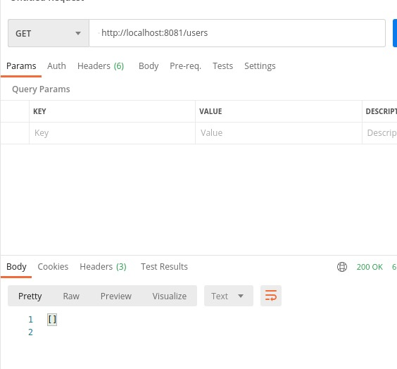

# Go API 

## CRUD operations with GORM

- Create (POST)
- Read (GET)
- Update (PUT)
- Delete (DELETE)

## API calls:
-   / 

- 	/users -> GET (All Users)
-	/user/{name}" -> "DELETE
-	/user/{name}/{lastname}/{city}/{email} -> PUT
-	/user/{name}/{lastname}/{city}/{email} -> POST

## Run the app

        go run *.go

## Examples

- Create
    - starting from scratch:

    
    - creating john johnson, from newyork, john@email.com:

    - creating annya solov, from moscow, annya@mail.com:

- Read

    - current data:

- Update

    - annya moved to barcelona, lets update that info:

    - current data:

- Delete

    - john moved to mars, lets delete him:

- result

## References:
- A great tutorial, and main source of study: https://tutorialedge.net/golang/golang-orm-tutorial/
- Go ORM querie tutorial : https://gorm.io/docs/query.html

